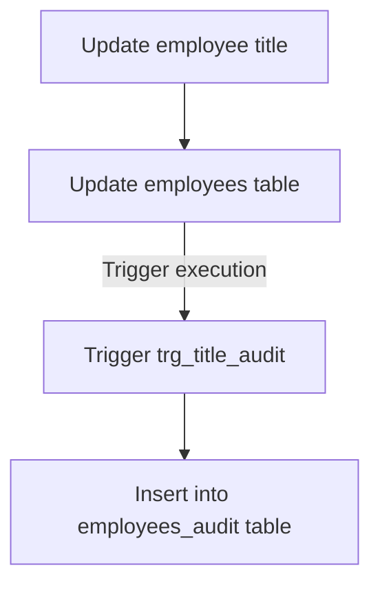
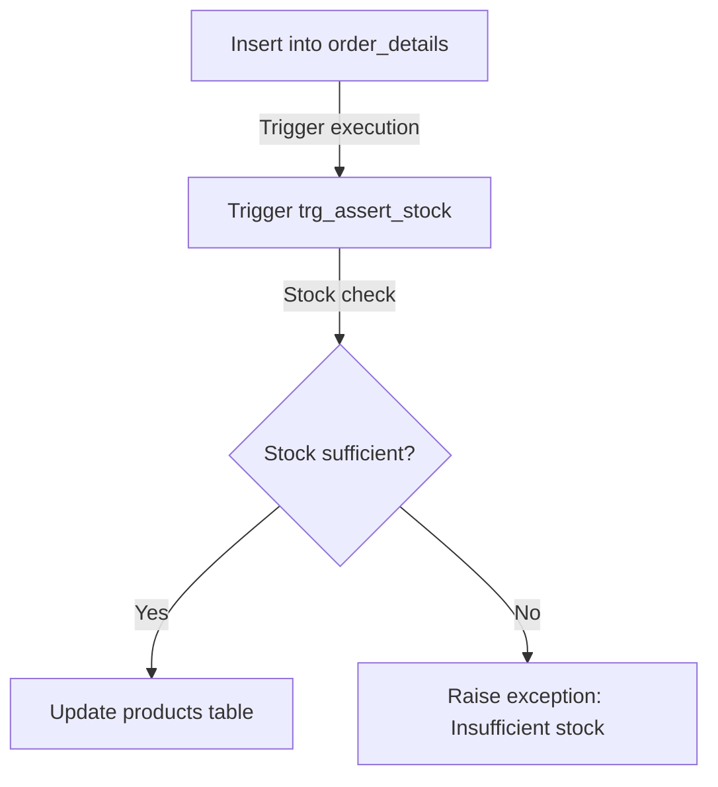

# Automating Northwind database operations using PL/pgSQL - Stored Procedures and Triggers

This project aims to use stored procedures and triggers in SQL to automate operations in a database.

The Northwind database contains sales data from Northwind Traders, a company that imports and exports specialty foods from around the world. By using the PL/pgSQL language on a PostgreSQL database server, two automations were implemented: the first to automatically register changes in an employee's title in a secondary table for future audits; the second to check if there is sufficient stock to fulfill a new order when it is added, as well as updating the stock quantity after the order is stored.

As these are just two simple automations, using SQL directly to perform this kind of operation can be beneficial in terms of performance and simplicity. Additionally, it promotes better integration with the existing database infrastructure and reduces dependencies on external tools or frameworks.

This project can be run using only Docker, as it builds both the PostgreSQL database and the pgAdmin client. All instructions are provided in the "How to Run This Project" section.

## How it works 

### Employees auditory table

This automation aims to monitor and update changes in employee titles in the `employees` table and record these changes in the `employees_audit` table.



The query below was used to create the `employees_audit` table, as it stores the employee ID, the previous function name, the new function name, and when the modification was performed.

```sql
CREATE TABLE employees_audit (
    employee_id INT,
    previous_title VARCHAR(100),
    new_title VARCHAR(100),
    modification_date TIMESTAMP DEFAULT CURRENT_TIMESTAMP
);
```

The automation works in a way that, every time an update of the title field happens in the `employees` table, it automatically triggers the function `register_title_audit()`, which is responsible for registering the change in the `employees_audit` table.

```sql
CREATE OR REPLACE FUNCTION register_title_audit()
RETURNS TRIGGER AS $$
BEGIN
    INSERT INTO employees_audit (employee_id, previous_title, new_title)
    VALUES (NEW.employee_id, OLD.title, NEW.title);
    RETURN NEW;
END;
$$ LANGUAGE plpgsql;

CREATE TRIGGER trg_title_audit
AFTER UPDATE OF title ON employees
FOR EACH ROW
EXECUTE FUNCTION register_title_audit();
```

A stored procedure was created to facilitate the update of an employee's title. It accepts the employee ID and the new title as parameters and executes an update in the `employees` table.

```sql
CREATE OR REPLACE PROCEDURE update_employee_title(
    p_employee_id INT,
    p_new_title VARCHAR(100)
)
AS $$
BEGIN
    UPDATE employees
    SET title = p_new_title
    WHERE employee_id = p_employee_id;
END;
$$ LANGUAGE plpgsql;
```


### Stock assertation




## Database context

The Northwind database contains sales data for a company called Northwind Traders, which imports and exports specialty foods from around the world.

The Northwind database is an ERP with data on customers, orders, inventory, purchases, suppliers, shipments, employees, and accounting.

The Northwind dataset includes sample data for the following:

* **Suppliers**: Northwind's suppliers and vendors
* **Customers**: Customers who purchase products from Northwind
* **Employees**: Details of Northwind Traders' employees
* **Products**: Product information
* **Shippers**: Details of carriers that ship the traders' products to end customers
* **Orders** and **Order Details**: Sales order transactions occurring between customers and the company

The Northwind database includes 14 tables, and the relationships between the tables are shown in the following entity relationship diagram.


## How to run this project

### Manually

After connecting to your own database, use the [`northwind.sql`](northwind.sql) file to populate the database by copying the script, pasting it into the query tool, and running it.

### With Docker

Its is required to have docker and docker compose intalled to be able to run this project.

- [Start with Docker](https://www.docker.com/get-started/)
- [Install Docker Compose](https://docs.docker.com/compose/install/)

Once we have docker avaiable, we do the following steps:

1. Clone the repository locally.
```bash 
git clone https://github.com/lealre/northwind-PLpgSQL.git
```

2. Access the project folder.
```bash
cd northwind-PLpgSQL
```

3. Build the Docker container.
```bash
docker compose up -d
```

The `-d` flag is used to run the container detached from the terminal.

4. Access pgAdmin at http://localhost:5050/

5. Set the master password (when accessing for the first time).


6. Right-click on the server to connect pgAdmin to the database.


7. Set the server name (it can be any name you want).


8. Connect to the database using the credentials we set in the [`docker-compose.yaml`](docker-compose.yaml) file.

`Host name`: `db`

`Password`: `postgres`

