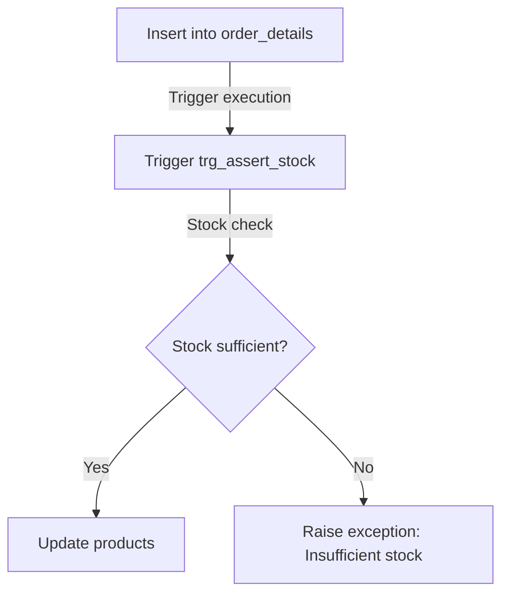
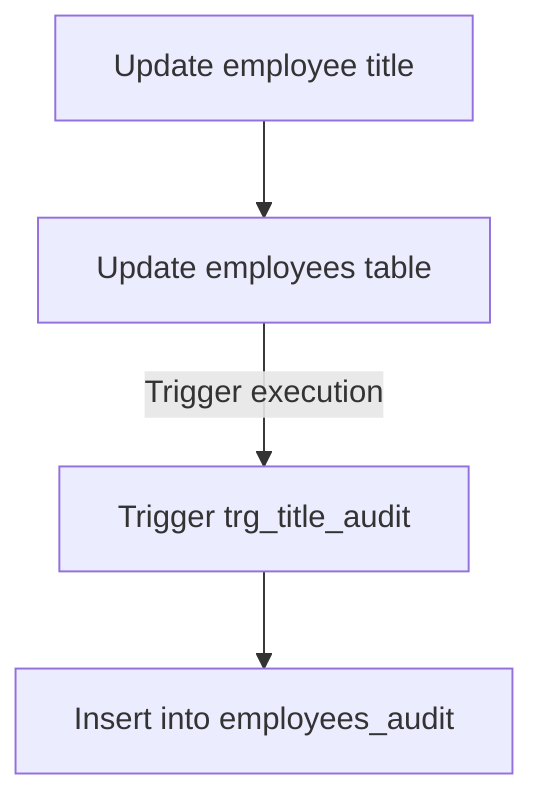
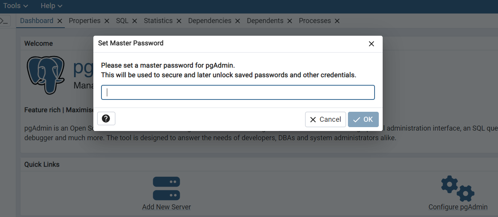
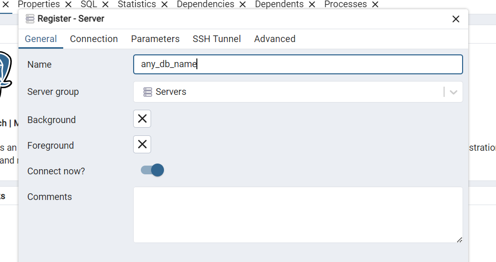
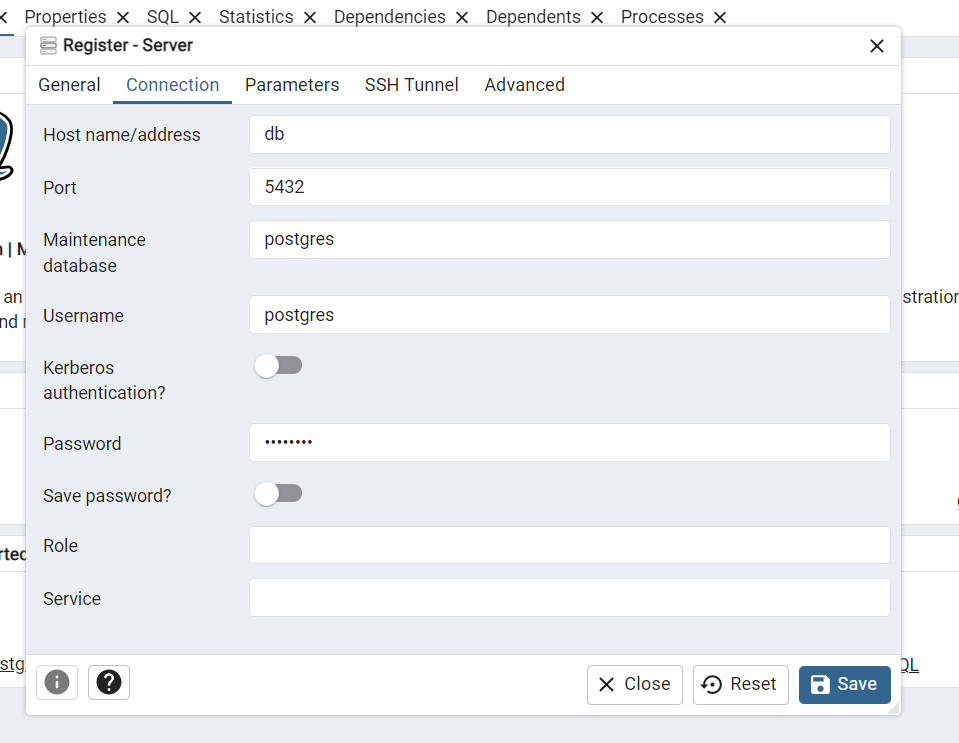

# northwind-PLpgSQL






## Database context

The Northwind database contains sales data for a company called Northwind Traders, which imports and exports specialty foods from around the world.

The Northwind database is an ERP with data on customers, orders, inventory, purchases, suppliers, shipments, employees, and accounting.

The Northwind dataset includes sample data for the following:

* **Suppliers**: Northwind's suppliers and vendors
* **Customers**: Customers who purchase products from Northwind
* **Employees**: Details of Northwind Traders' employees
* **Products**: Product information
* **Shippers**: Details of carriers that ship the traders' products to end customers
* **Orders** and **Order Details**: Sales order transactions occurring between customers and the company

The Northwind database includes 14 tables, and the relationships between the tables are shown in the following entity relationship diagram.


## How to run this project

### Manually

After connecting to your own database, use the [`northwind.sql`](northwind.sql) file to populate the database by copying the script, pasting it into the query tool, and running it.

### With Docker

Its is required to have docker and docker compose intalled to be able to run this project.

- [Start with Docker](https://www.docker.com/get-started/)
- [Install Docker Compose](https://docs.docker.com/compose/install/)

Once we have docker avaiable, we do the following steps:

1. Clone the repository locally.
```bash 
git clone https://github.com/lealre/northwind-PLpgSQL.git
```

2. Access the project folder.
```bash
cd northwind-PLpgSQL
```

3. Build the Docker container.
```bash
docker compose up -d
```

The `-d` flag is used to run the container detached from the terminal.

4. Access pgAdmin at http://localhost:5050/

5. Set the master password (when accessing for the first time).



6. Right-click on the server to connect pgAdmin to the database.


7. Set the server name (it can be any name you want).



8. Connect to the database using the credentials we set in the [`docker-compose.yaml`](docker-compose.yaml) file.

`Host name`: `db`

`Password`: `postgres`

